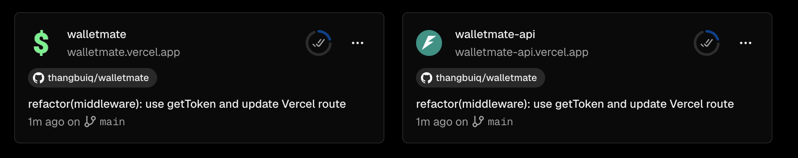

# walletmate

A monorepo containing the walletmate expense tracking application with AI-powered receipt parsing.

## Structure

```
walletmate/
├── walletmate-pwa-app/    # Next.js PWA frontend
└── walletmate-api/        # Python FastAPI backend
```

## Apps

### Frontend (walletmate-pwa-app)

Next.js 15 Progressive Web App with:
- AI-powered expense/income parsing (text & image)
- Dark/light theme support
- Vietnamese & English localization
- Offline-first PWA capabilities

**Tech stack:** Next.js, React, TypeScript, Tailwind CSS, TanStack Query

### Backend (walletmate-api)

Python FastAPI service providing:
- Text parsing endpoint (`POST /api/parse-text`)
- Image parsing endpoint (`POST /api/parse-image`)
- OpenAI GPT-4o-mini integration

**Tech stack:** Python 3.12, FastAPI, OpenAI SDK, Pydantic

## Development

### Prerequisites

- Node.js 20+ and Bun
- Python 3.12+ and uv

### Setup

```bash
# Frontend
cd walletmate-pwa-app
bun install
cp .env.example .env  # Configure your environment variables

# Backend
cd walletmate-api
uv sync
cp .env.example .env  # Add your OPENAI_API_KEY
```

### Running Locally

```bash
# Frontend (port 3000)
cd walletmate-pwa-app
bun dev

# Backend (port 8000)
cd walletmate-api
uv run uvicorn src.main:app --reload
```

### Pre-commit Hooks

This project uses [pre-commit](https://pre-commit.com/) for code quality:

```bash
# Install pre-commit
pip install pre-commit
# or
brew install pre-commit

# Install hooks
pre-commit install

# Run manually
pre-commit run --all-files
```

## Deployment



- **Frontend**: Vercel (walletmate-pwa-app)
- **Backend**: Vercel (walletmate-api)

## License

Private - All rights reserved
