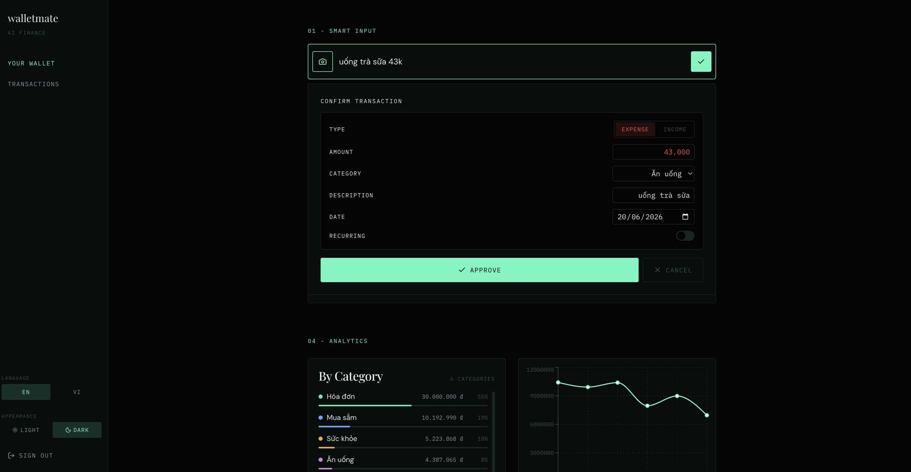
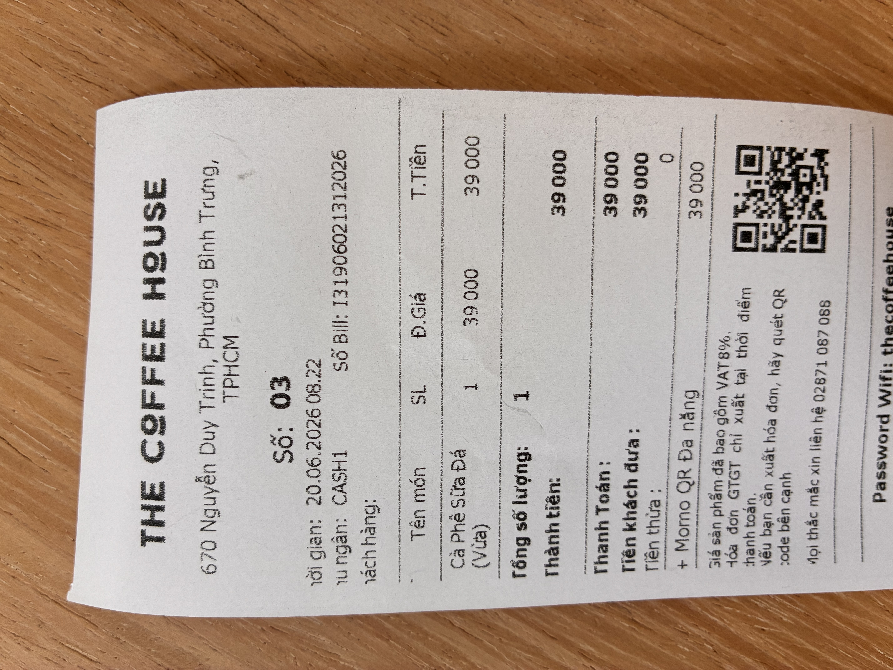
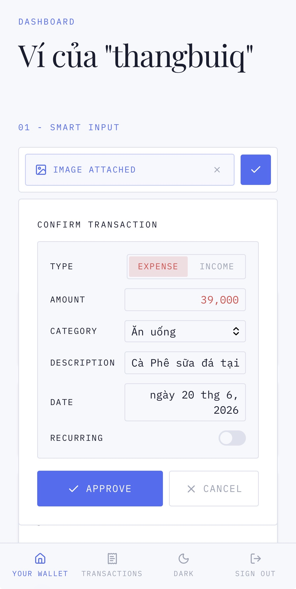

<div align="center">

# walletmate

> Tired of typing out every coffee or meal you buy? `walletmate` makes tracking your spending easy. Just take a picture of your receipt or type something like "bought coffee 50k today" and our AI will do the rest.



</div>

`walletmate` will also give you daily advice on how to save money, automatic tracking of your regular bills, and an app that works perfectly even without internet.

## Why use walletmate

- **Smart input**: easy receipt scan with AI or natural text input.
- **Daily spending advice**: get simple tips on how to manage your money better.
- **Smart bill detection**: we find out what bills you pay regularly.

## See Smart Input in Action

- Image Parsing:

    <table>
    <tr>
        <td>
        <strong>Snap a receipt</strong>
        </td>
        <td>
        <strong>AI will auto parse the image</strong>
        </td>
    </tr>
    <tr>
        <td width="50%" valign="top">
        
        </td>
        <td width="50%" valign="top">
        
        </td>
    </tr>
    </table>

- Text Parsing

    **Input:**

    ```text
    bought coffee 50k today
    ```

    **Output:**

    ```json
    {
        "type": "expense",
        "amount": 50000,
        "category": "Ăn uống",
        "description": "Cà phê sáng",
        "transactionDate": "2026-06-20"
    }
    ```

## Development

### Structure

```
walletmate/
├── walletmate-pwa-app/    # Next.js PWA frontend
└── walletmate-api/        # Python FastAPI backend
```

### Apps

#### Frontend (walletmate-pwa-app)

Next.js 15 Progressive Web App with:
- AI-powered expense/income parsing (text & image)
- Dark/light theme support
- Vietnamese & English localization
- Offline-first PWA capabilities

**Tech stack:** Next.js, React, TypeScript, Tailwind CSS, TanStack Query

#### Backend (walletmate-api)

Python FastAPI service providing:
- Text parsing endpoint (`POST /api/parse-text`)
- Image parsing endpoint (`POST /api/parse-image`)
- OpenAI GPT-4o-mini integration

**Tech stack:** Python 3.12, FastAPI, OpenAI SDK, Pydantic

### Prerequisites

- Node.js 20+ and Bun
- Python 3.12+ and uv

### Setup

```bash
# Frontend
cd walletmate-pwa-app
bun install
cp .env.example .env  # Configure your environment variables

# Backend
cd walletmate-api
uv sync
cp .env.example .env  # Add your OPENAI_API_KEY
```

### Running Locally

```bash
# Frontend (port 3000)
cd walletmate-pwa-app
bun dev

# Backend (port 8000)
cd walletmate-api
uv run uvicorn src.main:app --reload
```

### Pre-commit Hooks

This project uses [pre-commit](https://pre-commit.com/) for code quality:

```bash
# Install pre-commit
pip install pre-commit
# or
brew install pre-commit

# Install hooks
pre-commit install

# Run manually
pre-commit run --all-files
```

### Deployment

All apps will be deployed on Vercel automatically after each merge to main branch.


